## 19 Progressive Web Applications (PWA) : Text Editor(J.A.T.E)

## Description

1. Text Editor(J.A.T.E) is a just another text editor that runs in the browser. This app is a single-page application that meets the PWA criteria. Additionally, it is feature a number of data persistence techniques that serve as redundancy in case one of the options is not supported by the browser. The application is also function offline.

2. WHEN user open this web application in their editor. THEN he can see a client server folder structure.

3. WHEN user run `npm run start` from the root directory.THEN he can find that this application is start up the backend and serve the client.

4. WHEN user run the text editor application from their terminal. THEN he can find that their JavaScript files have been bundled using webpack.

5. WHEN user run their webpack plugins. THEN he can find that he have a generated HTML file, service worker, and a manifest file.

6. WHEN user use next-gen JavaScript in their application. THEN he can find that the text editor still functions in the browser without errors.

7. WHEN user open the text editor. THEN he can find that IndexedDB has immediately created a database storage.

8. WHEN user enter content and subsequently click off of the DOM window. THEN he can find that the content in the text editor has been saved with IndexedDB.

9. WHEN user reopen the text editor after closing it. THEN he can find that the content in the text editor has been retrieved from our IndexedDB.

10. WHEN user click on the Install button. THEN he have download his web application as an icon on desktop.

11. WHEN user load his web application. THEN he have a registered service worker using workbox.

12. WHEN user register a service worker. THEN he have his static assets pre cached upon loading along with subsequent pages and static assets.

13. WHEN user deploy to Heroku. THEN he have proper build scripts for a webpack application.

## Table of Contents

*  [URLs](#URLs)
*  [Installation](#Installation)
*  [Usage](#Usage)
*  [Assets](#Assets)
*  [Testing](#Testing)
*  [License](#License)

## Steps followed

1. Clone starter code from the remote repository "cautious-meme" to local repository "Text-Editor-PWA".

2. Manipulated the code according to the Acceptance Criteria.

3. Created "New Repository" in "GitHub" and named it as, "Text-Editor-PWA".

4. Created directories and files which are uploaded  from local repository to "GitHub".

5. Navigate to "GitHub" repository "Text-Editor-PWA" using "Git Bash".

6. Added description, screenshots in  "README"  file.

7. Performed, "add", "commit", "pull", "push", operations on source code.

8.  Deployed and assigned the "URL" to the website.

9. Added screenshot for final website appearance and Git Bash commands.

10. Deployed the entire application to Heroku.

## URLs
Here, you can find the webpage on Heroku.

 Application's Heroku URL:- 

Here, you can find the GitHub URL:-

https://github.com/AnujaLawankar/Text-Editor-pwa

## Installation

This application will use the following npm packages:-

  * npm install express (express.js)
  * npm install --save-dev webpack (Webpack)
  * npm install webpack-dev-server --save-dev (webpack-dev-server)
  * npm install --save-dev webpack-pwa-manifest (WebpackPwaManifest)
  * npm install babel (Babel)
  * npm install --save-dev css-loader (CSS-loader)
  * npm install concurrently --save (run multiple commands concurrently.) (Concurrently)
  * npm npm install idb (IndexedDB)

The required modules are bundled in the package.json file and at CLI or integrated terminal type in npm run install, the modules will be installed.

## Usage

Text-Editor-PWA is just a another editor which help user to work on web as well as without web connection. Which also have various dependencies like webpack and used service workers.

## Assets

The following image demonstrates the web application appearance:
1. Text Editor(J.A.T.E)'s web appearance
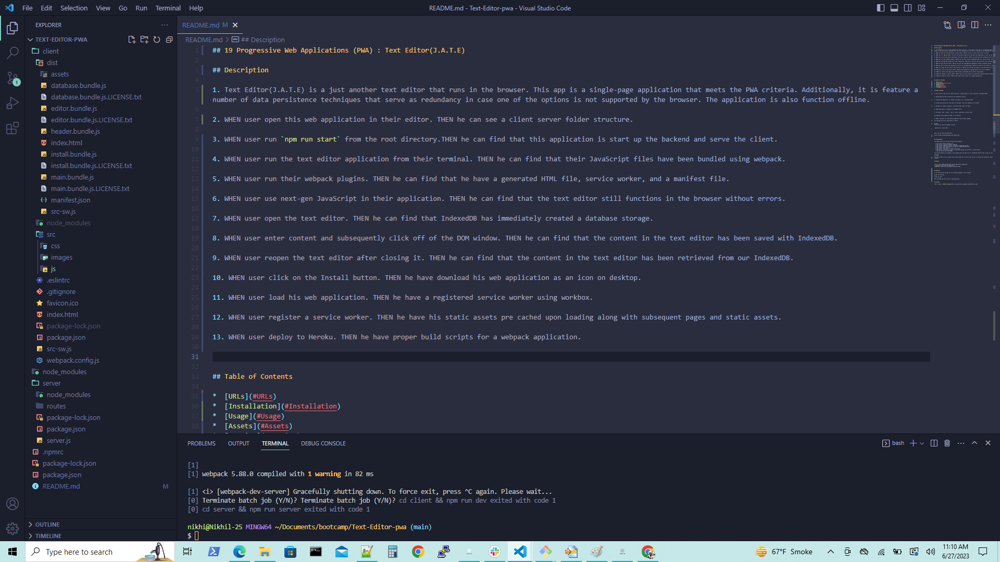

2. Text Editor(J.A.T.E)'s console.
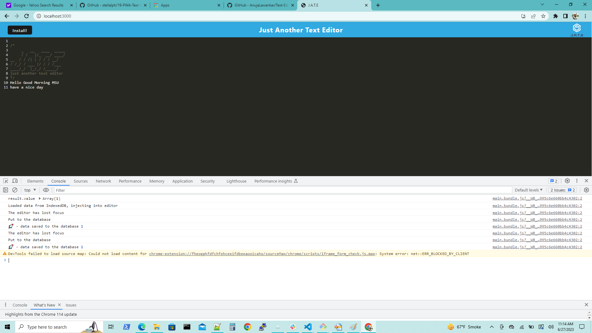

3. Text Editor(J.A.T.E)'s app manifest.
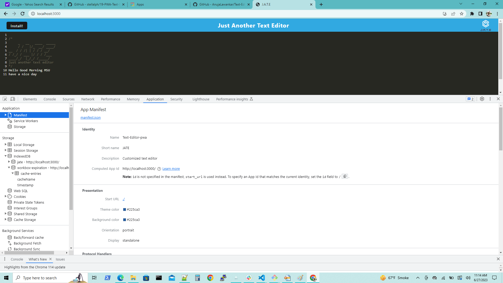

4. Text Editor(J.A.T.E)'s service workers.
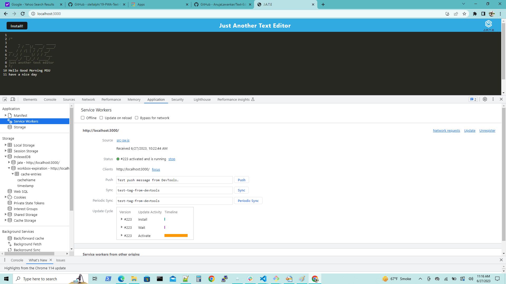

5. Text Editor(J.A.T.E)'s storage
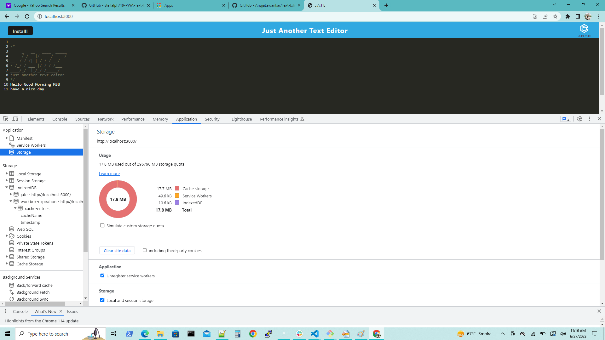

6.  Text Editor(J.A.T.E)'s IndexedDB
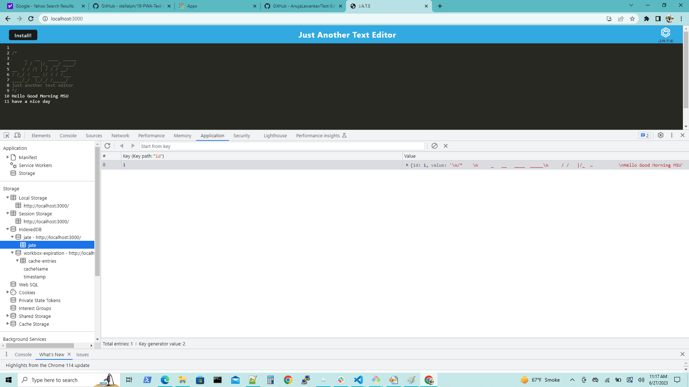

7. Text Editor(J.A.T.E)'s workbox expiration cache.
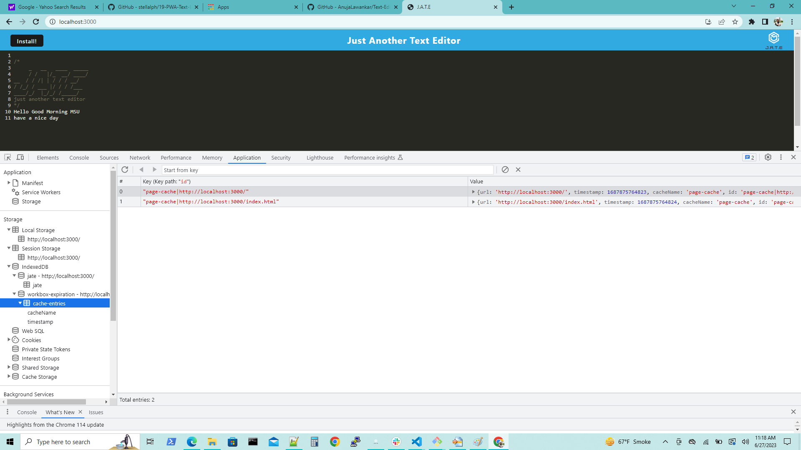

8. Text Editor(J.A.T.E)'s workbox percache
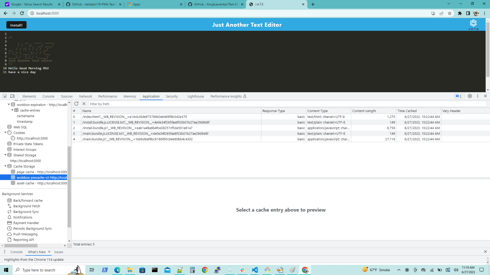

9. Text Editor(J.A.T.E)'s intall web application prompt
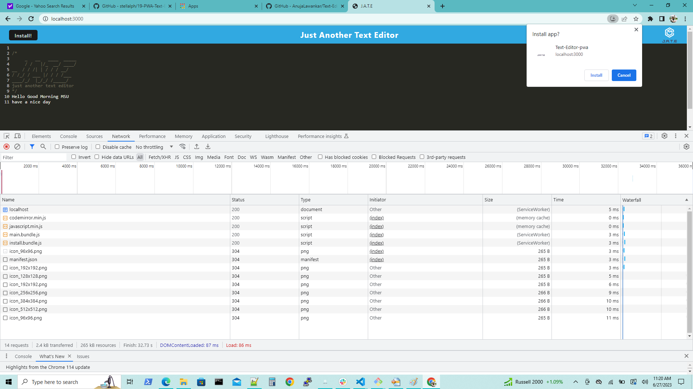

10. Text Editor(J.A.T.E) web application downloaded version.
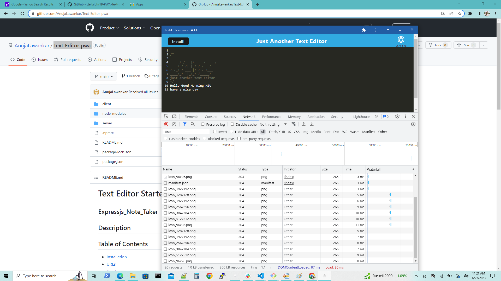

11. Text Editor(J.A.T.E) web application store on chrome apps.
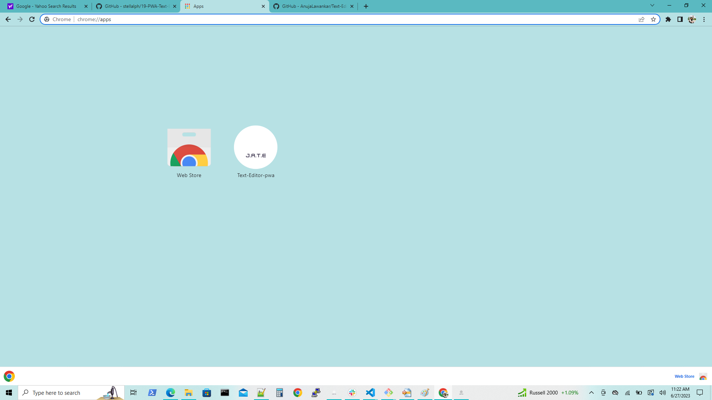

12. Text Editor(J.A.T.E) web application dwonloaded on desktop

## Testing

1. For testing this web app hit the following command in your terminal

* npm run start:dev
or
* npm run start

Both commands can use to start a web application.

## License

 MIT  License  